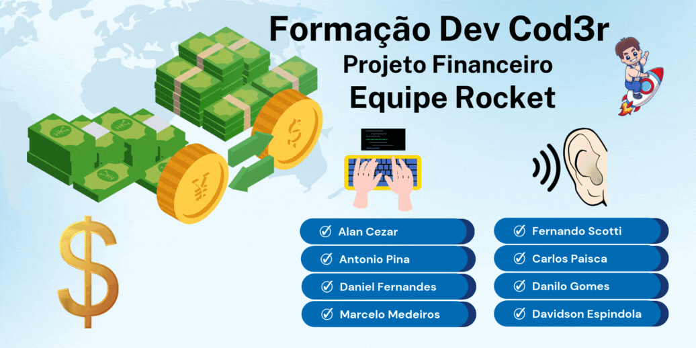

<div align="center">

  
 
</div>

# Status do Projeto


## 🤔 O que é este projeto

Este projeto consiste em um desafio entre Equipes da Formação DEV da [Cod3r](https://www.cod3r.com.br) turma **2024**, todos requisitos foram previamente definidos e seguem replicados abaixo como referência para o desenvolvimento da equipe:

## 🪜 Etapa 1 - Manipulação Registros
> Dica: Desenvolva essa etapa executando o código diretamente pelo terminal, sem interface gráfica.

### 📔 Requisitos Funcionais
- Um usuário deve conseguir cadastrar um novo registro, com as seguintes propriedades:
  - Descrição
  - Data do registro
  - Tipo do registro (que pode assumir apenas os valores despesa ou receita)
  - Valor do registro
  - Status do registro (que pode ser pendente, consolidado, ou cancelado)
  - Id (deve ser gerado automaticamente)
- Um usuário deve conseguir editar um registro já inserido podendo alterar a descrição, data, tipo, valor e status do registro
- Um usuário deve conseguir excluir um registro já existente
- Um usuário deve conseguir filtrar seus registros por status, podendo escolher entre consolodidados, pendentes, cancelados ou todos.

## 🪜 Etapa 2 - Interface

### 📔 Requisitos funcionais
- Ao entrar na aplicação o usuário deve ver todos seus registros com as inforamções de id, data, descrição, tipo, valor e status.
- Na tela inicial deve ser possível selecionar um filtro para os registros
- Ao clicar em um registro deve ser possível editá-lo
- Um usuário deve poder cancelar a edição de um registro
- O usuário deve poder criar um novo registro através de um botão
- Um usuário deve poder cancelar a criação de um novo registro
- O usuário deve poder excluir um registro

## ➕ Funcionalidades Extras [opcional]
- Implementar o fluxo de autenticação
- Agrupar os registros por mês
- Exibir resumo do mês com o total de receitas e despesas daquele mês

## 🆘 Materiais de apoio sugeridos

### 🗒️ Cursos da Formação sugeridos:
> Obs: Não é necessário ter feito todos os cursos para participar do projeto, mas se houverem dúvidas, esses cursos são um bom ponto de consulta.

- Fundamentos.DEV > Trilha Git e GitHub > Git e Github Básico
- Fundamentos.DEV > Trilha Git e GitHub > Git e Github Branches
- Especialista.DEV > Trilha React&Next > Fundamentos de React
- Especialista.DEV > Trilha React&Next > React com Tailwind CSS
- Especialista.DEV > Trilha React&Next > Next.JS
- Especialista.DEV > Trilha Banco de Dados > Banco Relacional
- Especialista.DEV > Trilha Banco de Dados > SQL
- Especialista.DEV > Trilha Backend > API com Express JS
- Especialista.DEV > Trilha Backend > Persistência com Knex.js

## 💎 Outros conteúdos sugeridos:
### Youtube da [Cod3r](https://www.cod3r.com.br)
- [Conceitos Essenciais: O Básico de HTTP](https://www.youtube.com/watch?v=CXzbUwK6lc8)
- [Backend limpo](https://www.youtube.com/watch?v=5p5sE62bBVs)

### 💬 Blog da Formação
- [Aprendendo a lidar com erros](https://blog.formacao.dev/aprendendo-a-lidar-com-erros/)
- [Instalando o PostgreSQL no Windows](https://blog.formacao.dev/instalando-o-postgresql-no-windows/)
- [Como armazenar senhas de usuários](https://blog.formacao.dev/como-armazenar-senhas-de-usuarios/)
- [Github Desktop](https://blog.formacao.dev/github-desktop/)
- [O que é o arquivo .gitignore](https://blog.formacao.dev/o-que-e-o-arquivo-gitignore/)
- [Validações com o pacote validator](https://blog.formacao.dev/validacoes-com-o-pacote-validator/)

## 📖 Referências
A interface desse projeto foi implementada a partir de um projeto do [Frontend Mentor](https://www.frontendmentor.io/)

## 🧰 Ferramentas utilizadas no desenvolvimento do projeto
- [VSCode](https://code.visualstudio.com)
- [Live Share](https://marketplace.visualstudio.com/items?itemName=MS-vsliveshare.vsliveshare)

## ⚙️ Tecnologias usadas no projeto
- [](https://www.w3schools.com/html/)
- [](https://www.w3schools.com/css/default.asp)
- [](https://www.w3schools.com/js/default.asp)

## 🧑‍💻 Formação da Equipe 🚀 Rocket
- 💻 [Alan Cezar](https://github.com/alanccezar) ⭐
- 💻 [Antonio Pina](https://github.com/AntonioDeveloper)
- 💻 [Daniel Fernandes](https://github.com/danielferlim)
- 💻 [Marcelo Campos](https://github.com/marcelocmedeiros)
- 👂 [Fernando Scotti](https://github.com/fernandoscottinunes)
- 👂 [Carlos Henrique](https://github.com/)
- 👂 [Danilo Gomes](https://github.com/danilogmoura)
- 👂 [Davidson Espindola](https://github.com/)

<!--
## 💻 Como rodar este projeto
Para rodar o projeto basta das dois cliques no arquivo *index.html* uma vez que a pasta do projeto esteja aberta no sistema de arquivos do seu sistema operacional.

Alternativamente, você também pode utilizar a extensão [Live Server](https://marketplace.visualstudio.com/items?itemName=ritwickdey.LiveServer) da IDE Visual Studio Code para rodar o projeto.

Para rodar este projeto execute os comandos abixo na pasta raiz do mesmo:
```
npm i
npm run dev
```
```
npm i
npm run serve
```
```
npm i
npm start
```

Será necessário ser previamente instalado na máquina:
- Node
- MySQL

Será necessário que um banco de dados no sistema X seja criado e preenchido com o código que está no arquivo Y.

## 🕹️ Como usar este projeto
Uma vez que a aplicação esteja rodando, você pode clicar nos círculos coloridos que são mostrados na página para alterar a cor de fundo da página. A cor será alterada de acordo com o botão que você pressionar.

## ⚙️ Tecnologias usadas no projeto
- [](https://www.w3schools.com/html/)
- [](https://www.w3schools.com/css/default.asp)
- [](https://www.w3schools.com/js/default.asp)

## 📔 Features do projeto
- 5 botões com cores diferentes que alteram a cor de fundo da página
- Subtítulo que é atualizado conforme a cor atual da página

## 📁 Como este projeto está organizado
Na pasta raíz do projeto, existem três arquvivos de código:
- index.html -> contém o html da aplicação
- style.css -> copntém os estilos da aplicação
- script.js -> contém o código javascript da aplicação

## 🧑‍💻 Como este projeto foi implementado
Este projeto foi implementado com HTML, CSS e Javascript.

No javascript os botões definidos no HTML são capturados através de um getElementsByTagName e é adicionado um event listener a cada um desses botões.

Ao clicar em um botão, é disparado um evento que irá alterar a cor de fundo da página e o título de segunda importância será atualizado com o código da cor, que está armazenado em um array.

## ⭐ Dependências Principais
Não temos dependências no projeto.

## 💎 Links úteis
- [Paleta de Cores](https://coolors.co/palette/d94e33-2c5697-ed9b33-8a9b8e-2d2926-f4e5de-dde5ed-f8f1e0-d7d2cb-dfdede)

## 🤝 Como contribuir com o projeto
[Clique aqui](./CONTRIBUTING.md) para as ver as diretrizes de contribuição

## 🧑‍💻 Formação da Equipe 🚀 Rocket
- 💻 [Alan Cezar](https://github.com/alanccezar) ⭐
- 💻 [Antonio Pina](https://github.com/AntonioDeveloper)
- 💻 [Daniel Fernandes](https://github.com/danielferlim)
- 💻 [Marcelo Campos](https://github.com/marcelocmedeiros)
- 👂 [Fernando Scotti](https://github.com/fernandoscottinunes)
- 👂 [Carlos Henrique](https://github.com/)
- 👂 [Danilo Gomes](https://github.com/danilogmoura)
- 👂 [Davidson Espindola](https://github.com/)
-->
<!--
## 🆘 Precisa de ajuda?
Você pode contatar o Alan (mantenedor do projeto) em alan@financetec.com.br ou entre em contato pelas redes sociais:

[](https://www.linkedin.com/in/alancezar/)

--------------------
<p align="center">Feito com ☕ por Alan</p>
-->
